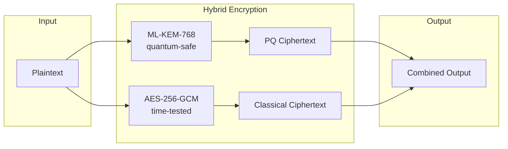
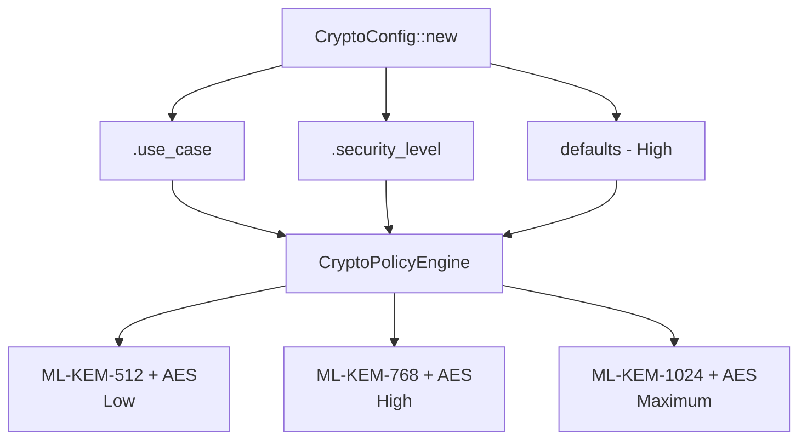
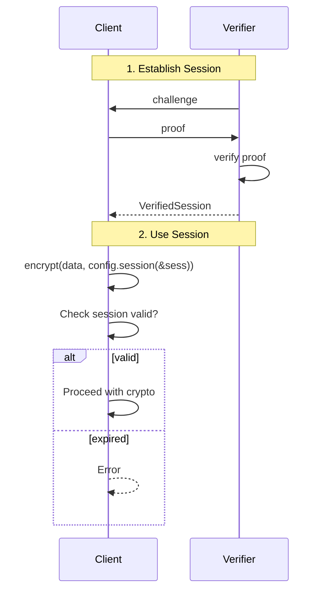

# LatticeArc

[](https://crates.io/crates/latticearc)
[](https://docs.rs/latticearc)
[](LICENSE)
[](https://www.rust-lang.org/)

LatticeArc is a post-quantum cryptography library for Rust, implementing the NIST FIPS 203-206 standards for quantum-resistant encryption and digital signatures.

## Why Post-Quantum Cryptography?

Current public-key cryptography (RSA, ECC) will be broken by quantum computers running Shor's algorithm. While large-scale quantum computers don't exist yet, encrypted data captured today can be decrypted in the future—a threat known as "harvest now, decrypt later."

NIST has standardized new quantum-resistant algorithms:
- **ML-KEM** (FIPS 203) - Key encapsulation based on lattice problems
- **ML-DSA** (FIPS 204) - Digital signatures based on lattice problems
- **SLH-DSA** (FIPS 205) - Hash-based digital signatures
- **FN-DSA** (FIPS 206) - Lattice-based signatures with smaller keys

## Why Hybrid Mode?

LatticeArc defaults to **hybrid cryptography** (PQ + classical) as recommended by [NIST SP 800-227](https://csrc.nist.gov/publications/detail/sp/800-227/draft):

> "Organizations may choose to implement hybrid solutions... to provide additional assurance during the transition period."



> **Defense in depth**: If *either* algorithm remains secure, your data is protected.

**Why not PQ-only?** ML-KEM/ML-DSA are new (standardized 2024). Hybrid provides defense-in-depth: if a flaw is discovered in the PQ algorithm, classical crypto still protects your data.

## Quick Start

```toml
[dependencies]
latticearc = "0.1"
```

### Encryption

```rust
use latticearc::{encrypt, decrypt, CryptoConfig};

let key = [0u8; 32];
let encrypted = encrypt(b"secret data", &key, CryptoConfig::new())?;
let decrypted = decrypt(&encrypted, &key, CryptoConfig::new())?;
```

### Digital Signatures

```rust
use latticearc::{sign, verify, CryptoConfig};

let signed = sign(b"document", CryptoConfig::new())?;
let is_valid = verify(&signed, CryptoConfig::new())?;
```

## Algorithm Selection

LatticeArc automatically selects algorithms based on your configuration:



### By Use Case (Recommended)

```rust
use latticearc::{encrypt, CryptoConfig, UseCase};

let encrypted = encrypt(data, &key, CryptoConfig::new()
    .use_case(UseCase::FileStorage))?;
```

| Use Case | Encryption | Signatures |
|----------|------------|------------|
| `FileStorage` | Hybrid (ML-KEM-1024 + AES-256-GCM) | Hybrid (ML-DSA-87 + Ed25519) |
| `SecureMessaging` | Hybrid (ML-KEM-768 + AES-256-GCM) | Hybrid (ML-DSA-65 + Ed25519) |
| `FinancialTransactions` | — | Hybrid (ML-DSA-65 + Ed25519) |
| `IoTDevice` | Hybrid (ML-KEM-512 + AES-256-GCM) | Hybrid (ML-DSA-44 + Ed25519) |

### By Security Level

```rust
use latticearc::{encrypt, CryptoConfig, SecurityLevel};

let encrypted = encrypt(data, &key, CryptoConfig::new()
    .security_level(SecurityLevel::Maximum))?;
```

| Level | Encryption | Signatures | NIST Level |
|-------|------------|------------|------------|
| `Maximum` | Hybrid (ML-KEM-1024 + AES-256-GCM) | Hybrid (ML-DSA-87 + Ed25519) | 5 |
| `High` | Hybrid (ML-KEM-768 + AES-256-GCM) | Hybrid (ML-DSA-65 + Ed25519) | 3 |
| `Medium` | Hybrid (ML-KEM-768 + AES-256-GCM) | Hybrid (ML-DSA-65 + Ed25519) | 3 |
| `Low` | Hybrid (ML-KEM-512 + AES-256-GCM) | Hybrid (ML-DSA-44 + Ed25519) | 1 |

## Zero Trust Sessions

For enterprise security, use verified sessions that enforce authentication before each operation:



```rust
use latticearc::{encrypt, generate_keypair, CryptoConfig, VerifiedSession};

let (pk, sk) = generate_keypair()?;
let session = VerifiedSession::establish(&pk, &sk)?;

// Session is verified before each operation
let encrypted = encrypt(data, &key, CryptoConfig::new().session(&session))?;
```

## Post-Quantum TLS

```rust
use arc_tls::{TlsConfig, TlsUseCase};

let config = TlsConfig::new()
    .use_case(TlsUseCase::WebServer);
```

| Use Case | TLS Mode | Key Exchange |
|----------|----------|--------------|
| `WebServer` | Hybrid | X25519 + ML-KEM-768 |
| `FinancialServices` | Hybrid | X25519 + ML-KEM-768 |
| `Government` | PQ-only | ML-KEM-1024 |
| `IoT` | Classic | X25519 |

## Crate Structure

| Crate | Description |
|-------|-------------|
| [`latticearc`](latticearc/) | Main API - start here |
| [`arc-core`](arc-core/) | Core types and unified API |
| [`arc-primitives`](arc-primitives/) | Cryptographic primitives (KEM, signatures, AEAD) |
| [`arc-hybrid`](arc-hybrid/) | Hybrid encryption combining PQC and classical |
| [`arc-tls`](arc-tls/) | Post-quantum TLS integration |
| [`arc-zkp`](arc-zkp/) | Zero-knowledge proofs |
| [`arc-validation`](arc-validation/) | Test vectors and compliance testing |

## Security

LatticeArc builds on audited cryptographic libraries:

| Component | Backend | Status |
|-----------|---------|--------|
| ML-KEM, AES-GCM | `aws-lc-rs` | FIPS 140-3 validated |
| ML-DSA | `fips204` | NIST compliant |
| SLH-DSA | `fips205` | NIST compliant |
| FN-DSA | `fn-dsa` | NIST compliant |
| Ed25519 | `ed25519-dalek` | Audited |
| TLS | `rustls` | Audited by Cure53 |

### Limitations

- **Not FIPS 140-3 certified** — We use FIPS-validated backends, but LatticeArc itself has not undergone CMVP validation
- **Not independently audited** — We welcome security researchers to review our code
- **Pre-1.0 software** — API may change between versions

### Reporting Vulnerabilities

Report security issues to: security@latticearc.com

See [SECURITY.md](SECURITY.md) for our security policy.

## Documentation

- [API Reference](https://docs.rs/latticearc)
- [Unified API Guide](docs/UNIFIED_API_GUIDE.md)
- [Security Guide](docs/SECURITY_GUIDE.md)
- [NIST Compliance](docs/NIST_COMPLIANCE.md)

## License

Apache License 2.0. See [LICENSE](LICENSE).

## Contributing

See [CONTRIBUTING.md](CONTRIBUTING.md).
