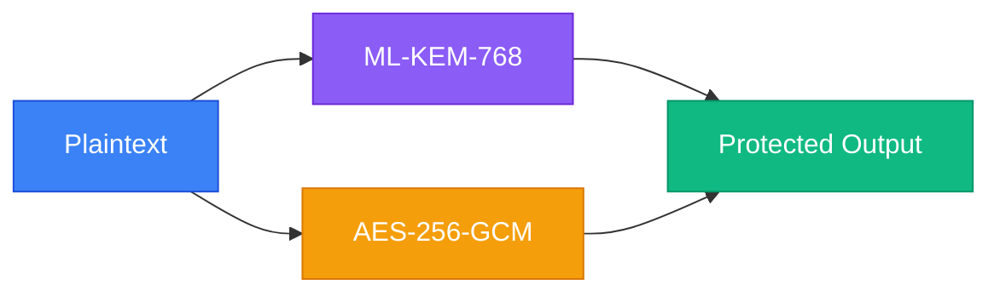
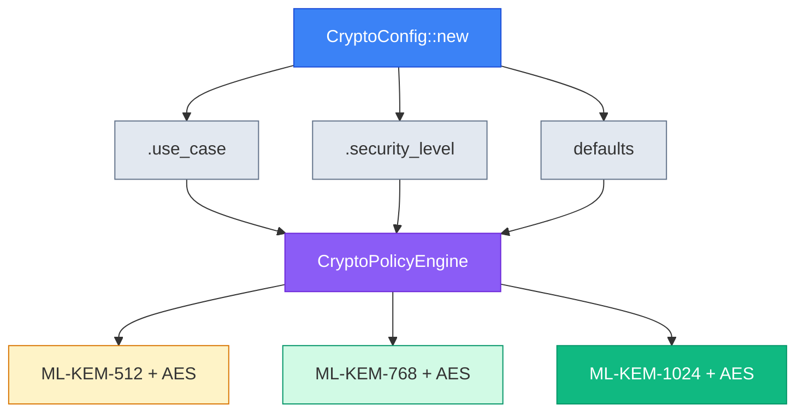
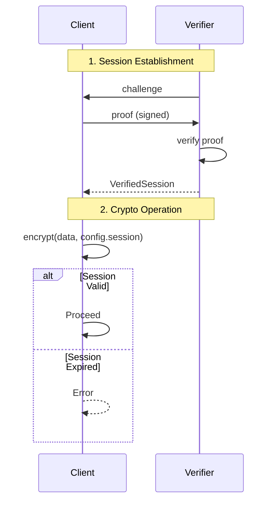

# LatticeArc

> **Evaluation Phase**: This project is currently in active development and evaluation. APIs may change without notice. Not recommended for production use yet.

[](LICENSE)
[](https://www.rust-lang.org/)
[](https://github.com/latticearc/latticearc/actions/workflows/ci.yml)
[](https://github.com/latticearc/latticearc/actions/workflows/security.yml)
[](https://github.com/latticearc/latticearc/actions/workflows/codeql.yml)
[](https://github.com/latticearc/latticearc/actions/workflows/kani.yml)
[](https://github.com/latticearc/latticearc/actions/workflows/fuzzing.yml)
[](https://github.com/latticearc/latticearc/actions/workflows/sbom.yml)
[](https://securityscorecards.dev/viewer/?uri=github.com/latticearc/latticearc)
[](https://www.bestpractices.dev/projects/11857)

LatticeArc is a post-quantum cryptography library for Rust, implementing the NIST FIPS 203-206 standards for quantum-resistant encryption and digital signatures.

## Why Post-Quantum Cryptography?

Current public-key cryptography (RSA, ECC) will be broken by quantum computers running Shor's algorithm. While large-scale quantum computers don't exist yet, encrypted data captured today can be decrypted in the future—a threat known as "harvest now, decrypt later."

NIST has standardized new quantum-resistant algorithms:
- **ML-KEM** (FIPS 203) - Key encapsulation based on lattice problems
- **ML-DSA** (FIPS 204) - Digital signatures based on lattice problems
- **SLH-DSA** (FIPS 205) - Hash-based digital signatures
- **FN-DSA** (FIPS 206) - Lattice-based signatures with smaller keys

## Why Hybrid Mode?

LatticeArc defaults to **hybrid cryptography** (PQ + classical) as recommended by [NIST SP 800-227](https://csrc.nist.gov/pubs/sp/800/227/final):

> "Organizations may choose to implement hybrid solutions... to provide additional assurance during the transition period."



> **Defense in depth**: If *either* algorithm remains secure, your data is protected.

**Why not PQ-only?** ML-KEM/ML-DSA are new (standardized 2024). Hybrid provides defense-in-depth: if a flaw is discovered in the PQ algorithm, classical crypto still protects your data.

## Quick Start

```toml
[dependencies]
latticearc = "0.1"
```

### Encryption

```rust
use latticearc::{encrypt, decrypt, CryptoConfig};

let key = [0u8; 32];
let encrypted = encrypt(b"secret data", &key, CryptoConfig::new())?;
let decrypted = decrypt(&encrypted, &key, CryptoConfig::new())?;
```

### Digital Signatures

```rust
use latticearc::{generate_signing_keypair, sign_with_key, verify, CryptoConfig};

let config = CryptoConfig::new();
let (pk, sk, _scheme) = generate_signing_keypair(config.clone())?;
let signed = sign_with_key(b"document", &sk, &pk, config.clone())?;
let is_valid = verify(&signed, config)?;
```

## Algorithm Selection

LatticeArc automatically selects algorithms based on your configuration:



### By Use Case (Recommended)

```rust
use latticearc::{encrypt, CryptoConfig, UseCase};

let encrypted = encrypt(data, &key, CryptoConfig::new()
    .use_case(UseCase::FileStorage))?;
```

### Hybrid Encryption

```rust
use latticearc::{generate_hybrid_keypair, encrypt_hybrid, decrypt_hybrid, SecurityMode};

// Generate hybrid keypair (ML-KEM-768 + X25519)
let (pk, sk) = generate_hybrid_keypair()?;

// Encrypt using hybrid KEM (ML-KEM + X25519 + HKDF + AES-256-GCM)
let encrypted = encrypt_hybrid(b"sensitive data", &pk, SecurityMode::Unverified)?;

// Decrypt
let plaintext = decrypt_hybrid(&encrypted, &sk, SecurityMode::Unverified)?;
```

### Hybrid Signatures

```rust
use latticearc::{generate_hybrid_signing_keypair, sign_hybrid, verify_hybrid_signature, SecurityMode};

// Generate hybrid signing keypair (ML-DSA-65 + Ed25519)
let (pk, sk) = generate_hybrid_signing_keypair(SecurityMode::Unverified)?;

// Sign (both ML-DSA and Ed25519 signatures generated)
let signature = sign_hybrid(b"document", &sk, SecurityMode::Unverified)?;

// Verify (both must pass for signature to be valid)
let valid = verify_hybrid_signature(b"document", &signature, &pk, SecurityMode::Unverified)?;
```

| Use Case | Encryption | Signatures |
|----------|------------|------------|
| `SecureMessaging` | Hybrid (ML-KEM-768 + AES-256-GCM) | Hybrid (ML-DSA-65 + Ed25519) |
| `FileStorage` | Hybrid (ML-KEM-1024 + AES-256-GCM) | Hybrid (ML-DSA-87 + Ed25519) |
| `FinancialTransactions` | — | Hybrid (ML-DSA-65 + Ed25519) |
| `Authentication` | — | Hybrid (ML-DSA-87 + Ed25519) |
| `HealthcareRecords` | Hybrid (ML-KEM-1024 + AES-256-GCM) | — |
| `GovernmentClassified` | Hybrid (ML-KEM-1024 + AES-256-GCM) | — |
| `IoTDevice` | Hybrid (ML-KEM-512 + AES-256-GCM) | Hybrid (ML-DSA-44 + Ed25519) |

> **24 use cases supported.** See [Unified API Guide](docs/UNIFIED_API_GUIDE.md) for the complete list including cloud storage, VPN, blockchain, firmware signing, and more.

### By Security Level

```rust
use latticearc::{encrypt, CryptoConfig, SecurityLevel};

let encrypted = encrypt(data, &key, CryptoConfig::new()
    .security_level(SecurityLevel::Maximum))?;
```

| Level | Mode | Encryption | Signatures | NIST Level |
|-------|------|------------|------------|------------|
| `Quantum` | PQ-only | ML-KEM-1024 + AES-256-GCM | ML-DSA-87 | 5 |
| `Maximum` | Hybrid | ML-KEM-1024 + AES-256-GCM | ML-DSA-87 + Ed25519 | 5 |
| `High` (default) | Hybrid | ML-KEM-768 + AES-256-GCM | ML-DSA-65 + Ed25519 | 3 |
| `Standard` | Hybrid | ML-KEM-512 + AES-256-GCM | ML-DSA-44 + Ed25519 | 1 |

> **Note:** `Quantum` mode uses PQ-only algorithms (no classical fallback) for CNSA 2.0 compliance. For complete security level documentation, see [docs/UNIFIED_API_GUIDE.md](docs/UNIFIED_API_GUIDE.md).

## Zero Trust Sessions

For enterprise security, use verified sessions that enforce authentication before each operation:



```rust
use latticearc::{encrypt, generate_keypair, CryptoConfig, VerifiedSession};

let (pk, sk) = generate_keypair()?;
let session = VerifiedSession::establish(&pk, &sk)?;

// Session is verified before each operation
let encrypted = encrypt(data, &key, CryptoConfig::new().session(&session))?;
```

## Post-Quantum TLS

```rust
use arc_tls::{TlsConfig, TlsUseCase};

let config = TlsConfig::new()
    .use_case(TlsUseCase::WebServer);
```

| Use Case | TLS Mode | Key Exchange |
|----------|----------|--------------|
| `WebServer` | Hybrid | X25519 + ML-KEM-768 |
| `InternalService` | Hybrid | X25519 + ML-KEM-768 |
| `ApiGateway` | Hybrid | X25519 + ML-KEM-768 |
| `FinancialServices` | Hybrid | X25519 + ML-KEM-768 |
| `Healthcare` | Hybrid | X25519 + ML-KEM-768 |
| `DatabaseConnection` | Hybrid | X25519 + ML-KEM-768 |
| `Government` | PQ-only | ML-KEM-1024 |
| `IoT` | Classic | X25519 |
| `LegacyIntegration` | Classic | X25519 |
| `RealTimeStreaming` | Classic | X25519 |

## Runnable Examples

The `latticearc` crate includes comprehensive examples demonstrating the API:

- `basic_encryption.rs` - Simple symmetric encryption with AES-256-GCM
- `digital_signatures.rs` - Digital signatures with ML-DSA and hybrid modes
- `hybrid_encryption.rs` - Hybrid encryption (ML-KEM + X25519 + HKDF)
- `post_quantum_signatures.rs` - Post-quantum signature schemes
- `complete_secure_workflow.rs` - End-to-end secure workflow with Zero Trust
- `zero_knowledge_proofs.rs` - Zero-knowledge proof demonstrations

Run an example with:
```bash
cargo run --example basic_encryption
cargo run --example digital_signatures
```

## Crate Structure

| Crate | Description |
|-------|-------------|
| [`latticearc`](latticearc/) | Main API - start here |
| [`arc-core`](arc-core/) | Core types and unified API |
| [`arc-primitives`](arc-primitives/) | Cryptographic primitives (KEM, signatures, AEAD) |
| [`arc-hybrid`](arc-hybrid/) | Hybrid encryption combining PQC and classical |
| [`arc-tls`](arc-tls/) | Post-quantum TLS integration |
| [`arc-zkp`](arc-zkp/) | Zero-knowledge proofs |
| [`arc-prelude`](arc-prelude/) | Common types, errors, and memory safety utilities |
| [`arc-validation`](arc-validation/) | Test vectors and compliance testing |
| [`arc-perf`](arc-perf/) | Performance benchmarking |

## Security

LatticeArc builds on audited cryptographic libraries:

| Component | Backend | Status |
|-----------|---------|--------|
| ML-KEM, AES-GCM | `aws-lc-rs` | FIPS 140-3 validated |
| ML-DSA | `fips204` | NIST compliant |
| SLH-DSA | `fips205` | NIST compliant |
| FN-DSA | `fn-dsa` | NIST compliant |
| Ed25519 | `ed25519-dalek` | Audited |
| TLS | `rustls` | Audited by Cure53 |

### Limitations

- **Not FIPS 140-3 certified** — We use FIPS-validated backends, but LatticeArc itself has not undergone CMVP validation
- **Not independently audited** — We welcome security researchers to review our code
- **Pre-1.0 software** — API may change between versions

### Reporting Vulnerabilities

Report security issues to: Security@LatticeArc.com

See [SECURITY.md](SECURITY.md) for our security policy.

## Documentation

- [API Reference](https://docs.rs/latticearc)
- [Unified API Guide](docs/UNIFIED_API_GUIDE.md) — algorithm selection, use cases, builder API
- [Architecture](docs/DESIGN.md) — crate structure, design decisions, enterprise features
- [Security Guide](docs/SECURITY_GUIDE.md) — threat model, secure usage patterns
- [NIST Compliance](docs/NIST_COMPLIANCE.md) — FIPS 203-206 conformance details
- [FAQ](docs/FAQ.md)

## License

Apache License 2.0. See [LICENSE](LICENSE).

## Contributing

See [CONTRIBUTING.md](CONTRIBUTING.md).
