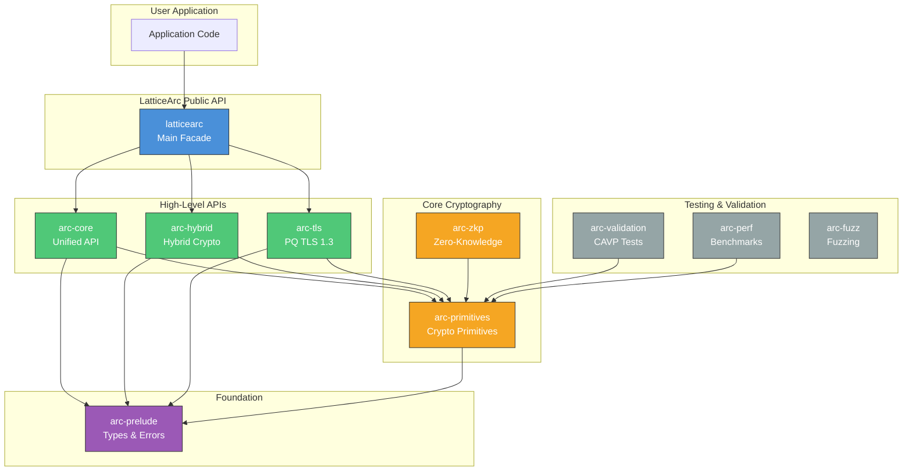
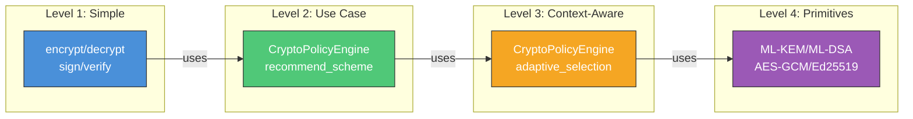
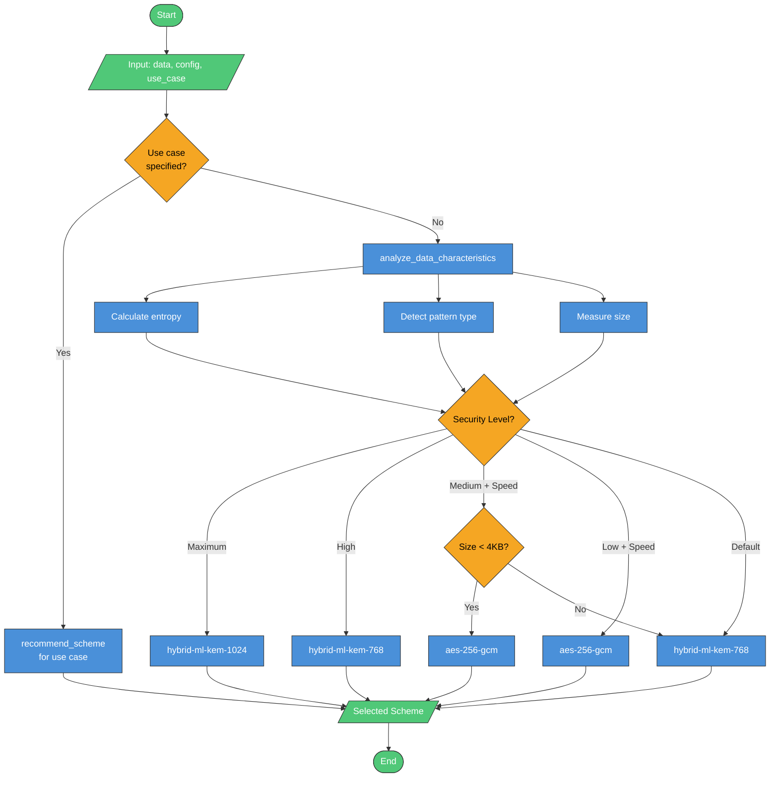
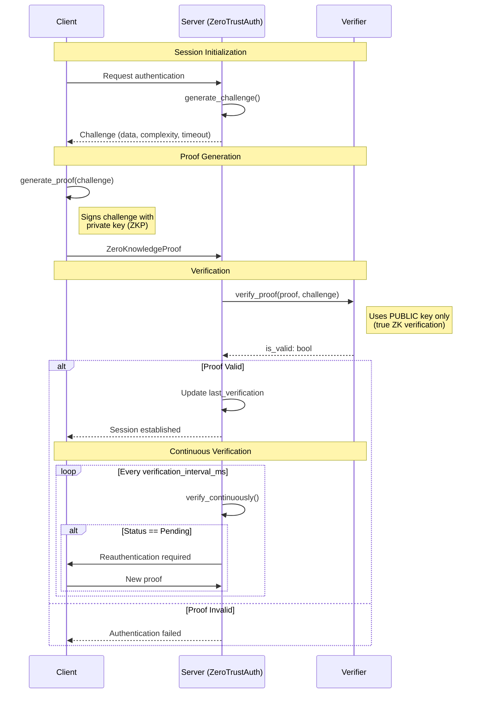
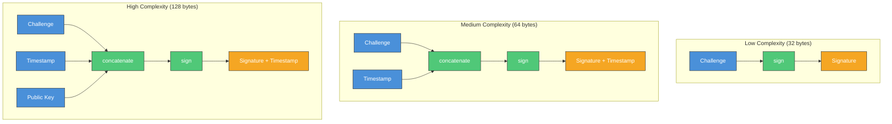
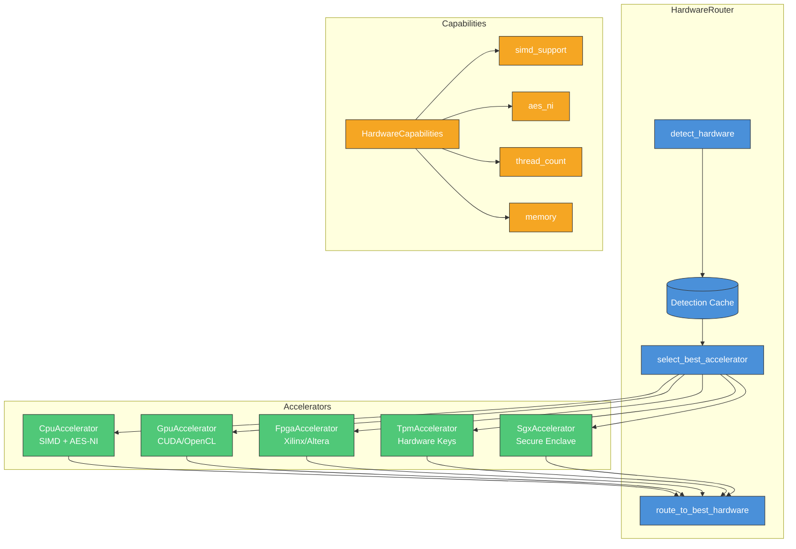
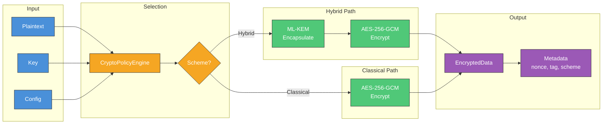
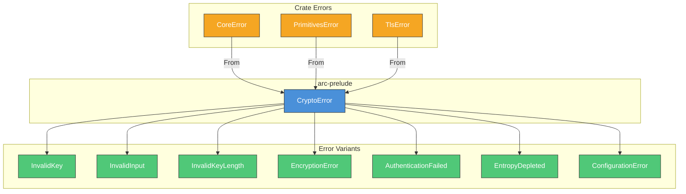
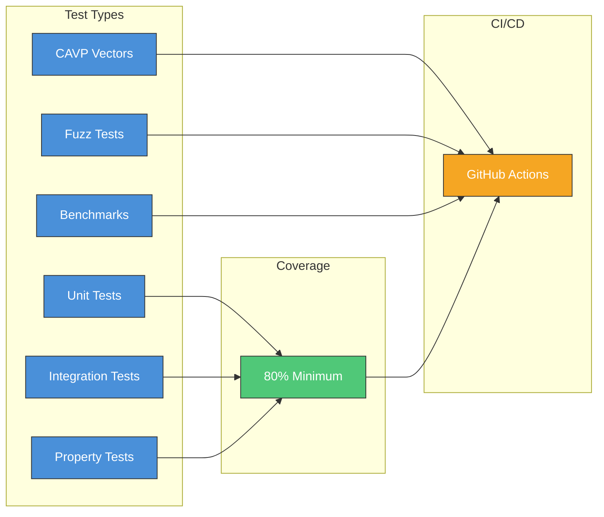

# LatticeArc Architecture

This document describes the architecture of LatticeArc, a post-quantum cryptography library with intelligent scheme selection, zero-trust authentication, and hardware acceleration.

## Design Principles

1. **Security First**: Defense-in-depth with hybrid PQ+classical, constant-time operations, memory safety
2. **Intelligent Defaults**: Auto-selection based on data, use case, and hardware
3. **Zero Trust**: Challenge-response authentication with ZKP at every operation
4. **Modularity**: Use only what you need, from high-level to low-level APIs
5. **FIPS Compliance**: NIST FIPS 203-206 compliant implementations

## Architecture Overview



## API Abstraction Levels

LatticeArc provides three abstraction levels:



## Scheme Selection Flow

The CryptoPolicyEngine analyzes data and configuration to select optimal schemes:



## Zero-Trust Authentication Flow

Challenge-response authentication with zero-knowledge proofs:



## Proof Complexity Levels



## Hardware Detection and Routing



## Encryption Data Flow



## Crate Descriptions

### `latticearc` (Main Facade)

Re-exports all public APIs from the workspace.

```rust
use latticearc::prelude::*;
// Access to all crates via single import
```

### `arc-core`

The Unified API layer with intelligent features:

| Module | Purpose |
|--------|---------|
| `convenience` | Simple encrypt/decrypt/sign/verify functions |
| `selector` | CryptoPolicyEngine |
| `zero_trust` | ZeroTrustAuth, Challenge, ZeroKnowledgeProof |
| `hardware` | HardwareRouter, accelerator detection |
| `config` | CoreConfig, ZeroTrustConfig, SecurityLevel |
| `types` | UseCase, PerformancePreference, CryptoContext |

### `arc-primitives`

Low-level cryptographic primitives:

| Module | Algorithms |
|--------|-----------|
| `kem/` | ML-KEM-512/768/1024 (FIPS 203) |
| `sig/` | ML-DSA-44/65/87 (FIPS 204), SLH-DSA (FIPS 205), FN-DSA (FIPS 206) |
| `aead/` | AES-256-GCM, ChaCha20-Poly1305 |
| `kdf/` | HKDF-SHA256, PBKDF2, SP800-108 |
| `hash/` | SHA-2, SHA-3 |
| `mac/` | HMAC-SHA256, CMAC |
| `ec/` | Ed25519, X25519, secp256k1, BLS12-381 |

### `arc-hybrid`

Hybrid cryptography combining PQ + classical:

| Component | Combination |
|-----------|-------------|
| HybridKem | ML-KEM + X25519 |
| HybridSignature | ML-DSA + Ed25519 |
| HybridEncrypt | ML-KEM + AES-GCM |

### `arc-tls`

Post-quantum TLS 1.3 with rustls:

- PQ key exchange (ML-KEM)
- Hybrid mode support
- Session resumption
- Connection monitoring

### `arc-prelude`

Common types and error handling:

- `CryptoError` hierarchy
- Common traits
- Memory safety utilities

### `arc-validation`

CAVP/FIPS compliance testing:

- NIST test vectors
- Self-test infrastructure
- Timing analysis

### `arc-zkp`

Zero-knowledge proof systems:

- Schnorr proofs
- Sigma protocols
- Pedersen commitments

## Key Design Decisions

### 1. No Unsafe Code

```rust
#![forbid(unsafe_code)]
```

All cryptographic operations use safe Rust, eliminating memory safety vulnerabilities.

### 2. No Panics in Library Code

```rust
#![deny(clippy::unwrap_used)]
#![deny(clippy::expect_used)]
#![deny(clippy::panic)]
```

All operations return `Result<T, E>`. Callers must handle errors explicitly.

### 3. Constant-Time by Default

```rust
use subtle::ConstantTimeEq;

// All secret comparisons use constant-time operations
fn verify_mac(computed: &[u8], received: &[u8]) -> bool {
    computed.ct_eq(received).into()
}
```

### 4. Automatic Zeroization

```rust
use zeroize::ZeroizeOnDrop;

#[derive(ZeroizeOnDrop)]
struct SecretKey {
    data: [u8; 32],
}
// Automatically zeroized when dropped
```

### 5. Hybrid by Default

All default schemes are hybrid (PQ + classical) for defense-in-depth:

```
DEFAULT_ENCRYPTION_SCHEME = "hybrid-ml-kem-768-aes-256-gcm"
DEFAULT_SIGNATURE_SCHEME  = "hybrid-ml-dsa-65-ed25519"
```

## Error Handling



## Feature Flags

| Feature | Description | Default |
|---------|-------------|---------|
| `std` | Standard library | Yes |
| `alloc` | Heap allocation | Yes |
| `serde` | Serialization | No |
| `zeroize` | Memory clearing | Yes |

## Testing Strategy



## References

- [FIPS 203: ML-KEM](https://csrc.nist.gov/pubs/fips/203/final)
- [FIPS 204: ML-DSA](https://csrc.nist.gov/pubs/fips/204/final)
- [FIPS 205: SLH-DSA](https://csrc.nist.gov/pubs/fips/205/final)
- [FIPS 206: FN-DSA](https://csrc.nist.gov/pubs/fips/206/final)
- [Rustls](https://github.com/rustls/rustls)
