# LatticeArc Architecture

This document describes the architecture of LatticeArc, a post-quantum cryptography library with intelligent scheme selection and zero-trust authentication framework.

## Open Source vs Enterprise

LatticeArc is available in two editions:

| Feature | Apache (Open Source) | Enterprise |
|---------|---------------------|------------|
| Core PQC primitives (ML-KEM, ML-DSA, SLH-DSA, FN-DSA) | ✅ | ✅ |
| Hybrid encryption (PQ + Classical) | ✅ | ✅ |
| Post-quantum TLS 1.3 | ✅ | ✅ |
| Scheme selection by use case | ✅ | ✅ |
| Zero-trust authentication framework | ✅ | ✅ |
| Hardware type definitions (traits only) | ✅ | ✅ |
| **Hardware detection & adaptive routing** | ❌ | ✅ |
| **ML-based attack detection** | ❌ | ✅ |
| **Self-healing security (auto key rotation)** | ❌ | ✅ |
| **Continuous trust verification** | ❌ | ✅ |
| **Per-operation policy enforcement** | ❌ | ✅ |
| **Runtime performance optimization** | ❌ | ✅ |
| **Graceful degradation system** | ❌ | ✅ |

> **Note**: This document covers the Apache (open source) edition. Enterprise features are marked with 🔒.

## Design Principles

1. **Security First**: Defense-in-depth with hybrid PQ+classical, constant-time operations, memory safety
2. **Hybrid by Default**: All encryption uses PQ + classical algorithms—no classical-only paths exposed
3. **Zero Trust Framework**: Challenge-response authentication with ZKP support
4. **Modularity**: Use only what you need, from high-level to low-level APIs
5. **FIPS Compliance**: NIST FIPS 203-206 compliant implementations

## Architecture Overview

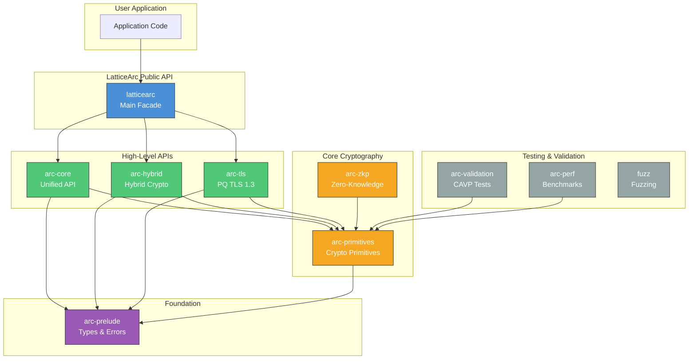

## API Abstraction Levels

LatticeArc provides multiple abstraction levels:

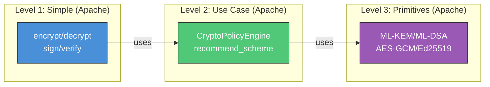

| Level | Apache | Enterprise |
|-------|--------|------------|
| **Level 1: Simple** | `encrypt()`, `decrypt()`, `sign()`, `verify()` | Same + session-aware variants |
| **Level 2: Use Case** | `recommend_scheme()` by security level/use case | Same |
| **Level 3: Primitives** | ML-KEM, ML-DSA, SLH-DSA, FN-DSA, AES-GCM | Same |
| **Level 4: Adaptive** | ❌ | 🔒 Runtime hardware detection, performance tracking, adaptive routing |
| **Level 5: Self-Healing** | ❌ | 🔒 Attack detection, auto key rotation, graceful degradation |

## Scheme Selection Flow

The CryptoPolicyEngine analyzes configuration to select optimal hybrid schemes:

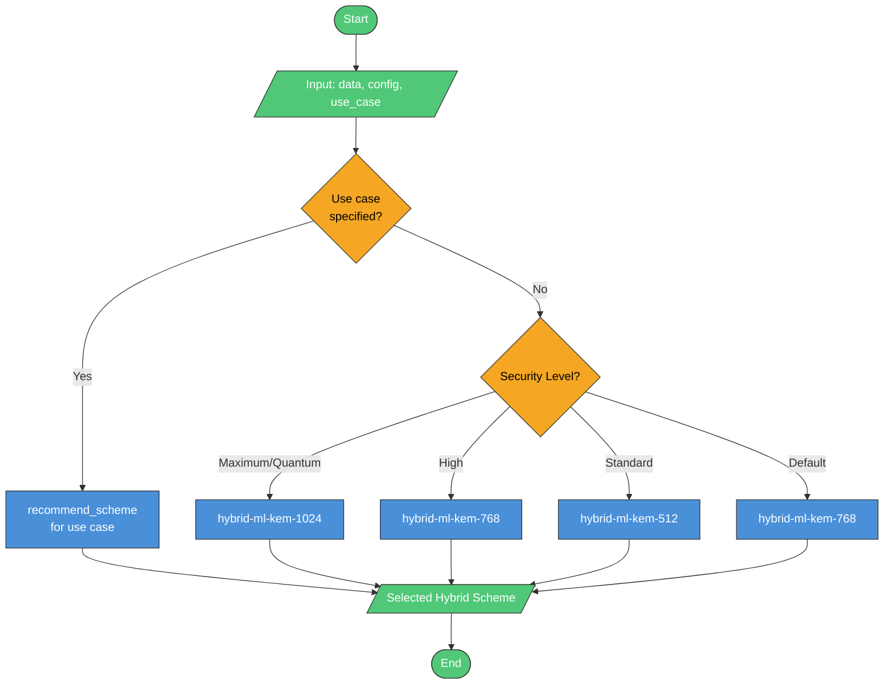

> **Note**: All schemes are hybrid (PQ + Classical). Classical-only encryption is not exposed in the public API.
>
> 🔒 **Enterprise Feature**: Adaptive scheme selection based on data characteristics, entropy analysis, and runtime performance metrics is available in LatticeArc Enterprise.

## Zero-Trust Authentication Flow

Challenge-response authentication framework with zero-knowledge proofs:

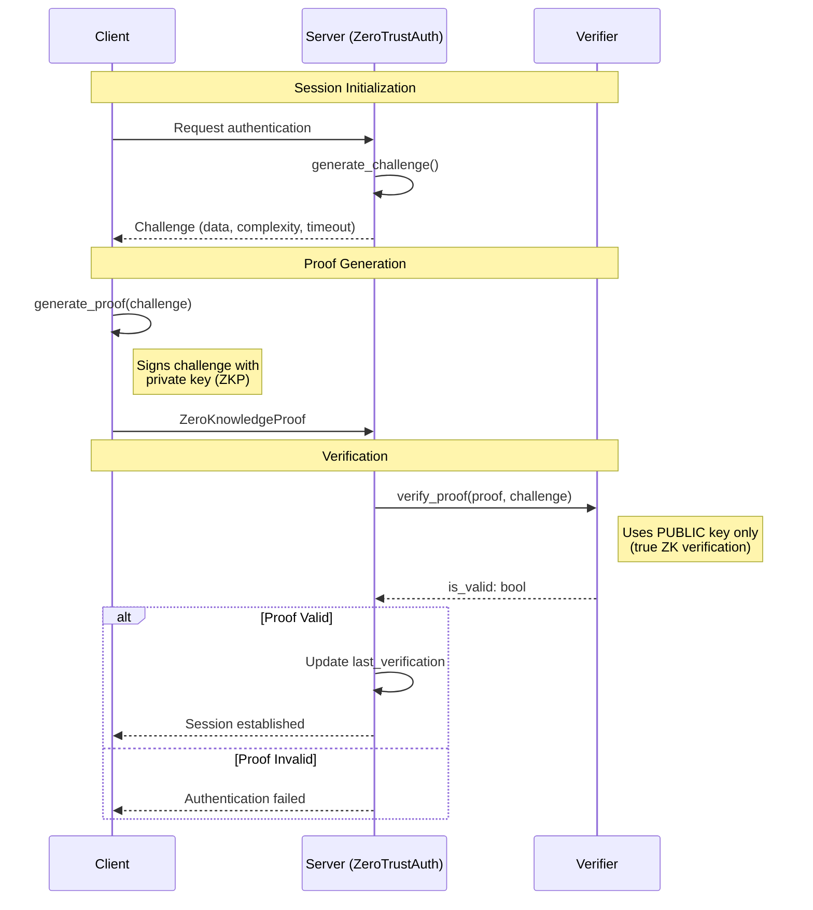

> **Apache Edition**: Provides the zero-trust authentication framework including challenge generation, proof creation, and verification. Applications integrate these primitives into their authentication flows.

🔒 **Enterprise Feature: Continuous Trust Verification**

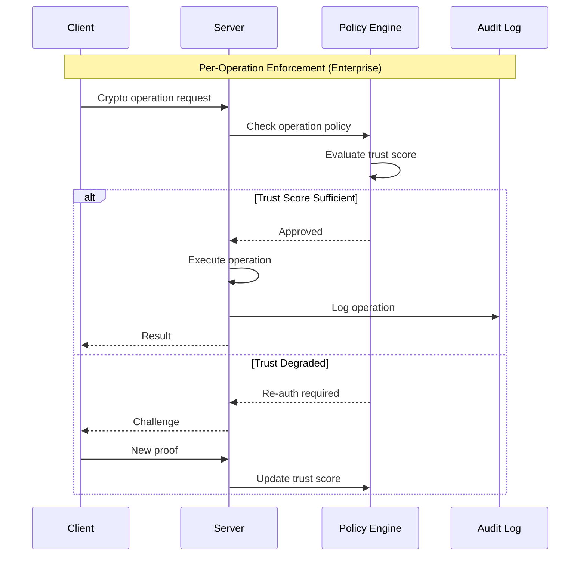

Enterprise edition provides:
- **Per-operation policy enforcement**: Every crypto operation checked against access policies
- **Continuous trust verification**: Dynamic trust scoring with automatic reauthentication
- **W3C DID integration**: Decentralized identity resolution (did:key, did:web)
- **Cryptographic audit trails**: Compliance-ready operation logging

## Proof Complexity Levels

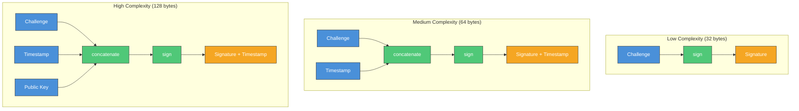

## Hardware Acceleration

The Apache edition provides **trait definitions only** for hardware-aware operations (`HardwareAccelerator`, `HardwareAware`, `HardwareCapabilities`, `HardwareInfo`, `HardwareType`). These define the interface contract but contain no detection or routing logic.

The underlying cryptography library (`aws-lc-rs`) handles AES-NI, SHA extensions, and SIMD acceleration automatically at the C level — no application-level hardware detection is needed for optimal performance.

> **Apache Edition**: Hardware acceleration traits only. No detection, no routing. The crypto primitives (`aws-lc-rs`) already use AES-NI and SIMD internally when available.

🔒 **Enterprise Feature: Hardware Detection & Adaptive Routing**

The enterprise `arc-enterprise-perf` crate provides real hardware detection and adaptive routing:

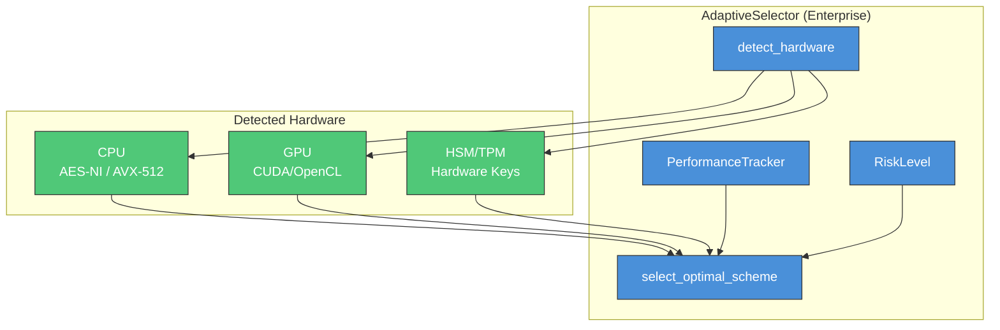

Enterprise edition dynamically selects cryptographic algorithms based on:
- Runtime hardware capability detection (CPU features, GPU, HSM/TPM)
- Continuous performance metrics with feedback loop
- Risk-level scaling (Normal → Critical, with security multipliers)
- Data size and characteristics

## Encryption Data Flow

All encryption in LatticeArc uses hybrid mode (PQ + Classical) for defense-in-depth:

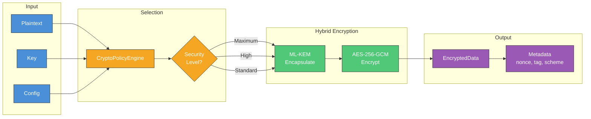

> **Security Note**: LatticeArc does not expose classical-only encryption. All data is protected by both post-quantum (ML-KEM) and classical (AES-256-GCM) algorithms, ensuring security even if one algorithm is compromised.

## Crate Descriptions

### `latticearc` (Main Facade)

Re-exports all public APIs from the workspace.

```rust
use latticearc::prelude::*;
// Access to all crates via single import
```

### `arc-core`

The Unified API layer with intelligent features:

| Module | Purpose |
|--------|---------|
| `convenience` | Simple encrypt/decrypt/sign/verify functions |
| `selector` | CryptoPolicyEngine |
| `zero_trust` | ZeroTrustAuth, Challenge, ZeroKnowledgeProof |
| `hardware` | Hardware trait re-exports (types only, no detection) |
| `config` | CoreConfig, ZeroTrustConfig, SecurityLevel |
| `types` | UseCase, PerformancePreference, CryptoContext |

### `arc-primitives`

Low-level cryptographic primitives:

| Module | Algorithms |
|--------|-----------|
| `kem/` | ML-KEM-512/768/1024 (FIPS 203) |
| `sig/` | ML-DSA-44/65/87 (FIPS 204), SLH-DSA (FIPS 205), FN-DSA (FIPS 206) |
| `aead/` | AES-256-GCM, ChaCha20-Poly1305 |
| `kdf/` | HKDF-SHA256, PBKDF2, SP800-108 |
| `hash/` | SHA-2, SHA-3 |
| `mac/` | HMAC-SHA256, CMAC |
| `ec/` | Ed25519, X25519, secp256k1, BLS12-381 |

### `arc-hybrid`

Hybrid cryptography combining PQ + classical:

| Component | Combination |
|-----------|-------------|
| HybridKem | ML-KEM + X25519 |
| HybridSignature | ML-DSA + Ed25519 |
| HybridEncrypt | ML-KEM + AES-GCM |

### `arc-tls`

Post-quantum TLS 1.3 with rustls:

- PQ key exchange (ML-KEM)
- Hybrid mode support
- Session resumption
- Connection monitoring

### `arc-prelude`

Common types and error handling:

- `LatticeArcError` hierarchy
- Common traits
- Memory safety utilities

### `arc-validation`

CAVP/FIPS compliance testing:

- NIST test vectors
- Self-test infrastructure
- Timing analysis

### `arc-zkp`

Zero-knowledge proof systems:

- Schnorr proofs
- Sigma protocols
- Pedersen commitments

## Key Design Decisions

### 1. No Unsafe Code

```rust
#![forbid(unsafe_code)]
```

All cryptographic operations use safe Rust, eliminating memory safety vulnerabilities.

### 2. No Panics in Library Code

```rust
#![deny(clippy::unwrap_used)]
#![deny(clippy::expect_used)]
#![deny(clippy::panic)]
```

All operations return `Result<T, E>`. Callers must handle errors explicitly.

### 3. Constant-Time by Default

```rust
use subtle::ConstantTimeEq;

// All secret comparisons use constant-time operations
fn verify_mac(computed: &[u8], received: &[u8]) -> bool {
    computed.ct_eq(received).into()
}
```

### 4. Automatic Zeroization

```rust
use zeroize::ZeroizeOnDrop;

#[derive(ZeroizeOnDrop)]
struct SecretKey {
    data: [u8; 32],
}
// Automatically zeroized when dropped
```

### 5. Hybrid by Default

All default schemes are hybrid (PQ + classical) for defense-in-depth:

```
DEFAULT_ENCRYPTION_SCHEME = "hybrid-ml-kem-768-aes-256-gcm"
DEFAULT_SIGNATURE_SCHEME  = "hybrid-ml-dsa-65-ed25519"
```

## Error Handling

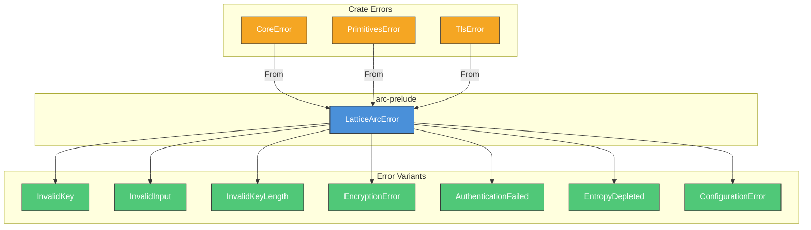

## Feature Flags

| Feature | Description | Default |
|---------|-------------|---------|
| `std` | Standard library | Yes |
| `alloc` | Heap allocation | Yes |
| `serde` | Serialization | No |
| `zeroize` | Memory clearing | Yes |

## Testing Strategy

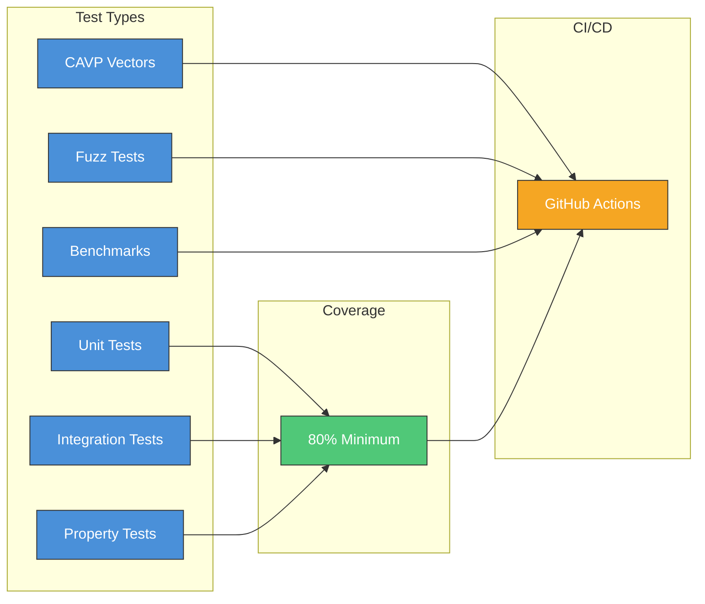

## 🔒 Enterprise Features

LatticeArc Enterprise extends the open source core with advanced security capabilities:

### Self-Healing Cryptographic Security

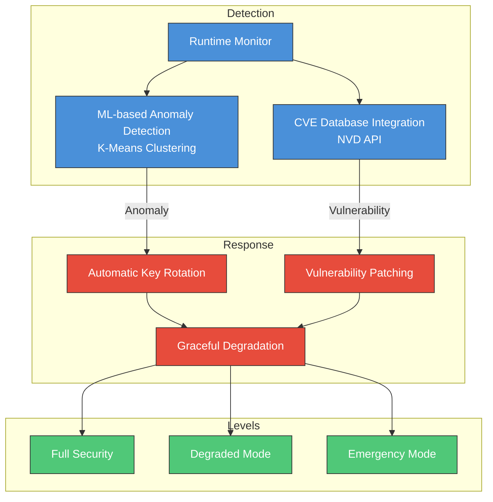

- **Attack Detection**: ML-based anomaly detection using K-Means clustering (< 100ms latency)
- **Auto-Remediation**: Automatic key rotation and algorithm switching on vulnerability detection
- **Graceful Degradation**: Multi-level fallback (Full → Degraded → Emergency) with security guarantees

### Runtime-Adaptive Algorithm Selection

The enterprise `AdaptiveSelector` performs runtime algorithm selection based on:

- **Hardware Detection**: CPU instruction sets (AES-NI, AVX-512), GPU, HSM/TPM availability
- **Performance Feedback**: Continuous measurement of algorithm latency and throughput
- **Risk-Level Scaling**: Dynamic security multipliers under active threat conditions

> **Note**: The Apache edition provides static `UseCase`-based scheme selection via `CryptoPolicyEngine` (a lookup table). Runtime-adaptive selection with hardware detection, performance feedback, and risk scaling is an enterprise-only feature.

### Zero-Trust at Operation Level

- **Per-Operation Policy**: Every cryptographic operation evaluated against access policies
- **W3C DID Integration**: Decentralized identity with did:key, did:web resolution
- **Continuous Verification**: Dynamic trust scoring with automatic reauthentication triggers
- **Compliance Audit Trails**: Cryptographic-level logging for regulatory compliance

### Performance Targets

| Metric | Target |
|--------|--------|
| Attack detection latency | < 100ms |
| Vulnerability patching | < 500ms |
| Threat prediction accuracy | > 85% |
| Degradation trigger | < 50ms |

For Enterprise licensing, contact: enterprise@latticearc.com

## References

- [FIPS 203: ML-KEM](https://csrc.nist.gov/pubs/fips/203/final)
- [FIPS 204: ML-DSA](https://csrc.nist.gov/pubs/fips/204/final)
- [FIPS 205: SLH-DSA](https://csrc.nist.gov/pubs/fips/205/final)
- [FIPS 206: FN-DSA](https://csrc.nist.gov/pubs/fips/206/final)
- [Rustls](https://github.com/rustls/rustls)
