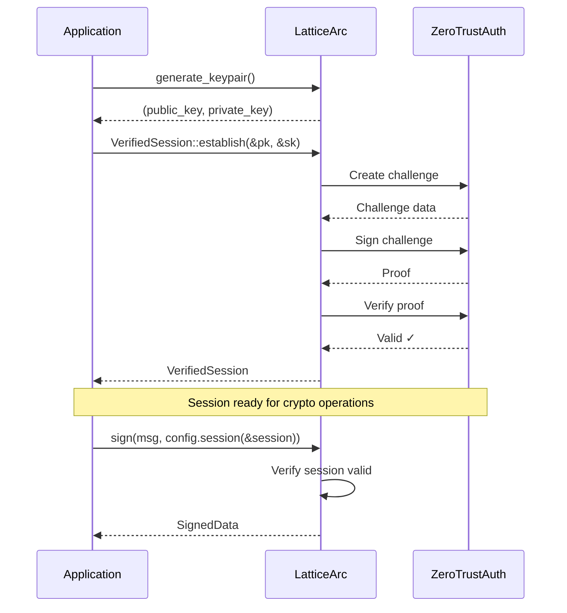

# LatticeArc Unified API Guide

A consistent, high-level cryptographic API with automatic algorithm selection and optional zero-trust authentication.

## Why LatticeArc?

### Pain Points Solved

| Problem | Without LatticeArc | With LatticeArc |
|---------|-------------------|-----------------|
| **Algorithm Selection** | Manually research NIST standards, parameter sizes, security levels | `CryptoConfig::new()` picks optimal defaults |
| **Quantum Migration** | Rewrite entire codebase for PQ algorithms | Change `use_case()` or `security_level()` |
| **Hybrid Crypto** | Implement complex multi-algorithm schemes | Built-in hybrid mode (PQ + classical) |
| **TLS Configuration** | Different APIs for rustls, certificate handling | `TlsConfig::new()` with same builder pattern |
| **Key Management** | Track multiple key types, parameter sets | Unified `generate_keypair()` functions |
| **Memory Safety** | Manual zeroization of sensitive data | Automatic `Zeroize` on drop |

### Architecture Overview


### Signing Flow


## Quick Start

### Digital Signatures

```rust
use latticearc::{sign, verify, CryptoConfig};

let message = b"Document to sign";

// Sign with defaults (ML-DSA-65 + Ed25519 hybrid)
let signed = sign(message, CryptoConfig::new())?;

// Verify
let is_valid = verify(&signed, CryptoConfig::new())?;
```

### Encryption

```rust
use latticearc::{encrypt, decrypt, CryptoConfig};

let key = [0u8; 32];  // 256-bit key
let plaintext = b"Sensitive data";

let encrypted = encrypt(plaintext, &key, CryptoConfig::new())?;
let decrypted = decrypt(&encrypted, &key, CryptoConfig::new())?;
```

### With Zero Trust Session

```rust
use latticearc::{sign, verify, generate_keypair, CryptoConfig, VerifiedSession};

let (public_key, private_key) = generate_keypair()?;
let session = VerifiedSession::establish(&public_key, &private_key)?;

let signed = sign(message, CryptoConfig::new().session(&session))?;
let is_valid = verify(&signed, CryptoConfig::new().session(&session))?;
```

## CryptoConfig

The central configuration type for cryptographic operations.


```rust
// Default: High security, hybrid mode
let config = CryptoConfig::new();

// By use case (library picks optimal algorithm)
let config = CryptoConfig::new()
    .use_case(UseCase::FileStorage);

// By security level
let config = CryptoConfig::new()
    .security_level(SecurityLevel::Maximum);

// With Zero Trust session
let config = CryptoConfig::new()
    .session(&session)
    .use_case(UseCase::FinancialTransactions);
```

### Builder Methods

| Method | Description |
|--------|-------------|
| `::new()` | Create with defaults (High security) |
| `.use_case(UseCase)` | Select algorithm by use case |
| `.security_level(SecurityLevel)` | Select algorithm by security level |
| `.session(&VerifiedSession)` | Enable Zero Trust verification |

## TlsConfig

TLS configuration follows the same builder pattern.

```rust
use arc_tls::{TlsConfig, TlsUseCase};

// Default: Hybrid mode (X25519 + ML-KEM)
let config = TlsConfig::new();

// By use case
let config = TlsConfig::new()
    .use_case(TlsUseCase::WebServer);

// With options
let config = TlsConfig::new()
    .use_case(TlsUseCase::FinancialServices)
    .with_fallback(true)
    .with_client_auth(true);
```

## Algorithm Selection

### By Use Case


**Communication**

| Use Case | Scheme |
|----------|--------|
| `SecureMessaging` | ML-KEM-768 + AES-256-GCM |
| `EmailEncryption` | ML-KEM-1024 + AES-256-GCM |
| `VpnTunnel` | ML-KEM-768 + AES-256-GCM |
| `ApiSecurity` | ML-KEM-768 + AES-256-GCM |

**Storage**

| Use Case | Scheme |
|----------|--------|
| `FileStorage` | ML-KEM-1024 + AES-256-GCM |
| `DatabaseEncryption` | ML-KEM-768 + AES-256-GCM |
| `CloudStorage` | ML-KEM-1024 + AES-256-GCM |
| `BackupArchive` | ML-KEM-1024 + AES-256-GCM |
| `ConfigSecrets` | ML-KEM-768 + AES-256-GCM |

**Authentication & Identity**

| Use Case | Scheme |
|----------|--------|
| `Authentication` | ML-DSA-87 + Ed25519 |
| `SessionToken` | ML-KEM-768 + AES-256-GCM |
| `DigitalCertificate` | ML-DSA-87 + Ed25519 |
| `KeyExchange` | ML-KEM-1024 + X25519 |

**Financial & Legal**

| Use Case | Scheme |
|----------|--------|
| `FinancialTransactions` | ML-DSA-65 + Ed25519 |
| `LegalDocuments` | ML-DSA-87 + Ed25519 |
| `BlockchainTransaction` | ML-DSA-65 + Ed25519 |

**Regulated Industries**

| Use Case | Scheme |
|----------|--------|
| `HealthcareRecords` | ML-KEM-1024 + AES-256-GCM |
| `GovernmentClassified` | ML-KEM-1024 + AES-256-GCM |
| `PaymentCard` | ML-KEM-1024 + AES-256-GCM |

**IoT & Embedded**

| Use Case | Scheme |
|----------|--------|
| `IoTDevice` | ML-KEM-512 + AES-256-GCM |
| `FirmwareSigning` | ML-DSA-65 + Ed25519 |

**Advanced**

| Use Case | Scheme |
|----------|--------|
| `SearchableEncryption` | ML-KEM-768 + AES-256-GCM |
| `HomomorphicComputation` | ML-KEM-768 + AES-256-GCM |
| `AuditLog` | ML-KEM-768 + AES-256-GCM |

All schemes above are hybrid (PQ + classical) by default.

### By Security Level

| Level | Mode | Encryption | Signature | NIST Level |
|-------|------|------------|-----------|------------|
| `Quantum` | PQ-only | ML-KEM-1024 + AES-256-GCM | ML-DSA-87 | 5 |
| `Maximum` | Hybrid | ML-KEM-1024 + AES-256-GCM | ML-DSA-87 + Ed25519 | 5 |
| `High` (default) | Hybrid | ML-KEM-768 + AES-256-GCM | ML-DSA-65 + Ed25519 | 3 |
| `Standard` | Hybrid | ML-KEM-512 + AES-256-GCM | ML-DSA-44 + Ed25519 | 1 |

### Security Level Details

- **Standard**: NIST Level 1 (128-bit equivalent). Hybrid mode using ML-KEM-512 + X25519, ML-DSA-44 + Ed25519. Suitable for resource-constrained devices and general use.
- **High**: NIST Level 3 (192-bit equivalent). Hybrid mode using ML-KEM-768 + X25519, ML-DSA-65 + Ed25519. Recommended for most enterprise applications. **(Default)**
- **Maximum**: NIST Level 5 (256-bit equivalent). Hybrid mode using ML-KEM-1024 + X25519, ML-DSA-87 + Ed25519. For high-value assets and long-term security.
- **Quantum**: NIST Level 5 (256-bit equivalent). PQ-only mode using ML-KEM-1024, ML-DSA-87 (no classical algorithms). For CNSA 2.0 compliance and government use cases. Must be explicitly selected.

## Zero Trust Authentication

### Session Establishment



### Using Sessions

```rust
use latticearc::{VerifiedSession, generate_keypair};

// Establish session
let (pk, sk) = generate_keypair()?;
let session = VerifiedSession::establish(&pk, &sk)?;

// Check session state
assert!(session.is_valid());
println!("Trust level: {:?}", session.trust_level());
println!("Expires at: {:?}", session.expires_at());

// Validate before critical operations
session.verify_valid()?;  // Returns Err if expired
```

## API Reference

### Signature Functions

```rust
use latticearc::{sign, verify, CryptoConfig};

// Sign (generates keypair internally)
let signed = sign(message, CryptoConfig::new())?;

// Verify (uses public key from SignedData)
let is_valid = verify(&signed, CryptoConfig::new())?;
```

### Encryption

```rust
use latticearc::{encrypt, decrypt, CryptoConfig};

let encrypted = encrypt(data, &key, CryptoConfig::new())?;
let plaintext = decrypt(&encrypted, &key, CryptoConfig::new())?;
```

### Key Generation

```rust
use latticearc::generate_keypair;
use arc_core::{generate_ml_kem_keypair, generate_ml_dsa_keypair};

// Ed25519
let (pk, sk) = generate_keypair()?;

// ML-KEM (FIPS 203)
let (pk, sk) = generate_ml_kem_keypair(MlKemSecurityLevel::MlKem768)?;

// ML-DSA (FIPS 204)
let (pk, sk) = generate_ml_dsa_keypair(MlDsaParameterSet::MLDSA65)?;
```

### Hashing and KDF

```rust
use latticearc::{hash_data, derive_key, hmac, SecurityMode};

let hash = hash_data(data);
let derived = derive_key(password, salt, 32, SecurityMode::default())?;
let mac = hmac(data, &key, SecurityMode::default())?;
```

## Error Handling

```rust
use latticearc::{sign, CoreError, CryptoConfig};

match sign(message, CryptoConfig::new().session(&session)) {
    Ok(signed) => { /* success */ }
    Err(CoreError::SessionExpired) => {
        // Re-authenticate
    }
    Err(CoreError::AuthenticationFailed(msg)) => {
        // Handle auth failure
    }
    Err(e) => {
        // Other errors
    }
}
```

## Comparison: Manual vs LatticeArc

### Manual Hybrid Signing (~50 lines)

```rust
// Generate ML-DSA keypair
let (pq_pk, pq_sk) = ml_dsa_65::try_keygen()?;
// Generate Ed25519 keypair
let ed_sk = SigningKey::generate(&mut OsRng);
// Sign with both algorithms
let pq_sig = ml_dsa_65::try_sign(&pq_sk, message, &[])?;
let ed_sig = ed_sk.sign(message);
// Return 4 separate components...
```

### LatticeArc (2 lines)

```rust
let signed = sign(message, CryptoConfig::new())?;
let is_valid = verify(&signed, CryptoConfig::new())?;
```

| Aspect | Manual | LatticeArc |
|--------|--------|------------|
| Lines of code | ~50 | 2 |
| Key management | 4 separate vectors | Single `SignedData` |
| Algorithm updates | Code changes | Config change |
| Memory safety | Manual | Automatic |

## Security Considerations

1. **Quantum Safety** — All defaults use hybrid schemes (PQ + classical)
2. **Key Zeroization** — Automatic memory clearing via `Zeroize`
3. **Constant-Time** — Timing-safe comparisons via `subtle` crate
4. **Nonce Uniqueness** — Auto-generated secure random nonces
5. **Input Validation** — All inputs validated against resource limits
